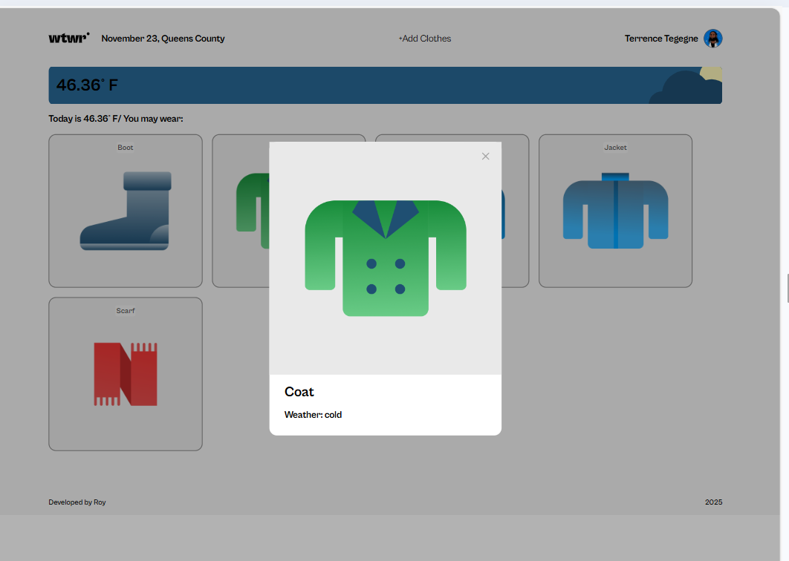

# WTWR - What to wear

_A weather app where it suggests a set of garments one can wear in that particular location depending on the weather condition._

## 🚀 Live Demo

[View Live Demo:](https://samir-kumar-roy.github.io/se_project_react/)

## 📖 Table of Contents

- [About the Project](#about-the-project)
- [Tech Stack](#tech-stack)
- [Installation](#installation)
- [Environment Variables](#environment-variables)
- [Usage](#usage)
- [API Reference](#api-reference)
- [Folder Structure](#folder-structure)
- [Screenshots](#screenshots)
- [Roadmap](#roadmap)
- [Contributing](#contributing)
- [License](#license)
- [Contact](#contact)

## About the Project

This is a weather app where I am fetching weather data from open weather map. And according to this dada condition(cold, warm or hot) it suggests me some colothes I can wear on at this particular period of the day. And based on weather it is day time or night time and weather condition (cloudy or sunny), it shows variable image on the weather card above the suggested garments.
I can add a garment or preview it using a generic modal in this app.

## Tech Stack

**Frontend:** React, HTML, CSS, JavaScript
**APIs:** OpenWeatherMap, etc.

## Installation

```bash
git clone https://github.com/samir-kumr-roy/se_project_react.git
cd se_project_react
npm install
```

```bash
API_KEY=71ccef76e6ea44982bf6e721d8280f7d
PORT=3000
```

## Usage

```bash
npm run dev
```

## API Reference

```http
GET https://openweathermap.org/
```

## Folder Structure

```
se_project_react/
│── public/
│── src/
│   ├── components/
│   ├── assets/
│   ├── vendor/
│   ├── utils/
│── .env
│── package.json
│── README.md
|── vite.config.js
```

## Screenshots





## Roadmap

- [ ] Building an API
- [ ] Adding Authentication and authorization
- [ ] Add unit tests
- [ ] Add deployment with CI/CD

## Contributing

1. Fork the project
2. Create a branch
3. Commit changes
4. Open a pull request

## License

MIT License

## Contact

— [Email:] samirroy.8990@gmail.com
— [Github:] https://github.com/samir-kumar-roy
— [LinkedIn:] https://linkedin.com/in/samir-kumar-roy
